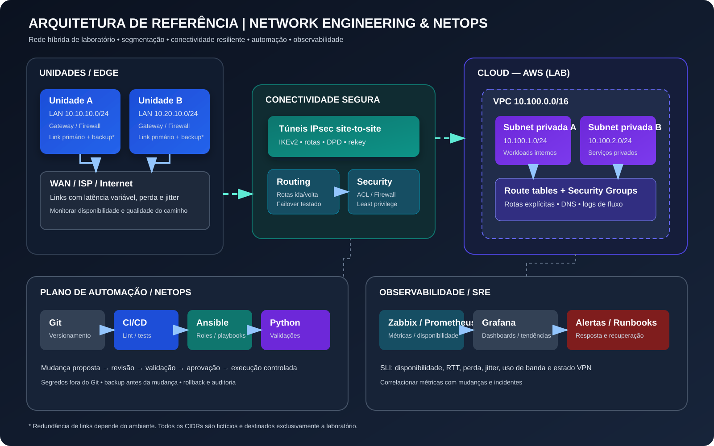

# Arquitetura de referência — rede híbrida e NetOps

> **Objetivo do material:** demonstrar raciocínio de engenharia de redes para ambientes distribuídos, links de qualidade variável, conectividade segura com cloud, automação e operação orientada a métricas.
>
> **Importante:** esta é uma arquitetura de laboratório independente, criada para portfólio e preparação para entrevista. Não representa a topologia interna da ALTAVE. Todos os endereços e exemplos são fictícios.

## Topologia visual



[Ver o diagrama SVG em tamanho original](./topology.svg)

## 1. Contexto e requisitos de arquitetura

O cenário de referência considera unidades remotas conectadas a serviços privados em cloud. A solução deve continuar operável quando houver latência elevada, perda de pacotes, flutuação do link ou indisponibilidade de um caminho.

### Requisitos funcionais

- Conectar redes locais e sub-redes privadas na cloud com rotas de ida e volta.
- Proteger o tráfego entre sites com túneis IPsec site-to-site.
- Permitir expansão de unidades sem sobreposição de endereços.
- Automatizar inventário, validações e mudanças repetíveis usando Git, Ansible e Python.
- Monitorar disponibilidade, latência, perda, jitter, uso de banda e estado de VPN.
- Manter histórico de mudanças, evidências de validação e plano de rollback.

### Requisitos não funcionais

| Requisito | Como tratar |
|---|---|
| Segurança | Menor privilégio, segmentação, gestão restrita e segredos fora do Git |
| Resiliência | Caminhos alternativos quando disponíveis, detecção de falha e testes de recuperação |
| Operabilidade | Runbooks, logs, alertas acionáveis e ownership claro |
| Repetibilidade | Inventário versionado, templates, validação e revisão por pull request |
| Escalabilidade | Blocos CIDR reservados por site, ambiente e região |
| Auditabilidade | Mudanças identificáveis, revisão, timestamps e evidências |

## 2. Blocos lógicos

1. **Edge de cada unidade:** roteador/firewall, gateway LAN e interfaces WAN.
2. **Transporte WAN:** provedor primário e, se disponível, caminho de contingência. A diversidade física/lógica dos caminhos precisa ser confirmada com o provedor.
3. **Conectividade segura:** IPsec site-to-site, monitoramento de peer, política de rotas e validação de MTU/MSS.
4. **Cloud:** VPC, sub-redes privadas, tabelas de rotas, security groups/NACLs conforme o desenho e DNS privado quando necessário.
5. **Plano de gestão:** estação ou runner Linux, Git, Ansible, Python e pipeline CI.
6. **Observabilidade:** coleta de métricas, dashboards, alertas, logs e runbooks operacionais.

## 3. Plano de endereçamento de laboratório

Os prefixos abaixo são apenas exemplos didáticos. Não os utilize em produção sem validação contra o inventário corporativo.

| Zona | Prefixo de exemplo | Uso |
|---|---|---|
| Unidade A | `10.10.10.0/24` | LAN de usuários/dispositivos da unidade A |
| Unidade B | `10.20.10.0/24` | LAN de usuários/dispositivos da unidade B |
| AWS VPC | `10.100.0.0/16` | Bloco agregado do laboratório cloud |
| AWS subnet privada A | `10.100.1.0/24` | Workloads internos |
| AWS subnet privada B | `10.100.2.0/24` | Serviços internos separados |
| Gestão de laboratório | `10.200.0.0/24` | Automação e administração restrita |

### Regras para gestão de IP

- Reservar um bloco por região, ambiente e site antes da implantação.
- Verificar sobreposição entre LANs, VPCs/VNets, VPNs de terceiros e redes de gestão.
- Documentar gateway, VLAN, finalidade, ambiente, responsável e origem da rota.
- Agregar rotas quando isso simplificar o desenho sem ampliar indevidamente o acesso.
- Tratar o inventário como fonte de verdade; evitar que documentação e configuração diverjam.
- Automatizar a checagem de sobreposição. O script em [`04-python/validate_networks.py`](../04-python/validate_networks.py) é um ponto de partida.

## 4. Fluxos de tráfego esperados

| Origem | Destino | Caminho esperado | Controles |
|---|---|---|---|
| LAN Unidade A | Aplicação privada AWS | Gateway A → IPsec → roteamento cloud → subnet privada | ACL/firewall, rota de retorno, logs |
| LAN Unidade B | Serviço privado AWS | Gateway B → IPsec → roteamento cloud → subnet privada | ACL/firewall, rota de retorno, logs |
| Runner de automação | Equipamentos gerenciados | Rede de gestão → SSH/API/HTTPS conforme plataforma | Allowlist, autenticação forte, segredo protegido |
| Equipamentos de rede | Plataforma de monitoramento | Caminho de gestão/telemetria aprovado | Portas mínimas, autenticação, sincronização de horário |
| Usuário da LAN | Internet | Política de saída definida pela organização | DNS, filtragem e logging conforme necessidade |

Não habilitar acesso administrativo direto da Internet aos equipamentos. Os fluxos acima descrevem intenção de desenho; as portas exatas dependem das plataformas e políticas aprovadas.

## 5. Roteamento e convergência

- Documentar rotas locais, remotas, agregadas e default; definir qual equipamento anuncia cada prefixo.
- Validar a rota de ida **e** a rota de retorno. Um ping unilateral não comprova conectividade bidirecional.
- Evitar anúncios excessivamente amplos e redistribuição de rotas sem filtros.
- Se BGP for usado, documentar ASN, prefixos permitidos, políticas de importação/exportação e comportamento de failover.
- Se forem usadas rotas estáticas, definir como a indisponibilidade do túnel remove ou invalida a rota.
- Verificar assimetria, ECMP, preferência de caminhos, blackhole e loops.
- Testar convergência com um plano aprovado, janela de mudança e acesso fora de banda quando possível.

### Checklist de validação de roteamento

- [ ] Prefixos de origem e destino estão no inventário.
- [ ] Existe rota de ida e de retorno.
- [ ] Filtros de anúncio limitam os prefixos esperados.
- [ ] Não há sobreposição de CIDRs.
- [ ] O comportamento de falha foi testado em laboratório.
- [ ] Evidências de antes/depois foram guardadas.

## 6. VPN IPsec para links com latência variável

A configuração real deve considerar a plataforma, versão de software, capacidade criptográfica, NAT e requisitos de segurança da organização.

- Preferir parâmetros criptográficos atuais aprovados pela política de segurança.
- Validar IKE/IPsec, identidade dos peers, lifetimes, rekey e detecção de peer indisponível.
- Verificar se NAT-T é necessário no caminho.
- Calcular a MTU útil considerando os cabeçalhos de encapsulamento; testar fragmentação e PMTUD.
- Ajustar MSS apenas com medições e testes, evitando mascarar problemas de MTU.
- Medir perda, RTT e jitter separadamente; latência alta não é o mesmo que perda.
- Não presumir que a VPN esteja operacional apenas porque a interface/túnel aparece como ativo: testar tráfego real entre prefixos autorizados.

Consulte o [runbook de resiliência VPN](../06-vpn-resilience/runbook.md) para uma sequência de diagnóstico.

## 7. Segmentação e segurança

- Separar redes de usuários, dispositivos/IoT, servidores, gestão e monitoramento conforme os requisitos.
- Aplicar menor privilégio entre zonas; negar por padrão quando apropriado.
- Restringir SSH, APIs e interfaces administrativas a uma rede de gestão controlada.
- Usar contas nominativas, chaves ou mecanismos corporativos de identidade, rotação de credenciais e trilha de auditoria.
- Armazenar segredos em secret manager ou mecanismo protegido do pipeline; nunca em arquivos versionados.
- Tratar logs de fluxo e logs administrativos conforme política de retenção e privacidade.
- Revisar regras antigas, objetos sem uso e exceções temporárias com prazo de expiração.
- Separar credenciais de laboratório das credenciais de qualquer ambiente real.

## 8. NetOps e automação segura

### Fluxo de mudança recomendado

1. Criar issue com objetivo, escopo, risco, impacto e plano de reversão.
2. Alterar inventário, templates ou código em branch.
3. Executar validações estáticas: YAML, sintaxe Ansible, lint e testes Python.
4. Revisar o diff e conferir se a mudança respeita o escopo previsto.
5. Fazer backup e coletar estado atual antes de qualquer mudança de configuração.
6. Obter aprovação e executar primeiro em laboratório ou grupo piloto.
7. Validar conectividade, rotas, serviços e métricas depois da mudança.
8. Registrar resultado, evidências e eventuais desvios; executar rollback se os critérios de sucesso não forem atendidos.

### Guardrails mínimos

- Preferir playbooks de coleta/validação antes de playbooks que alteram configuração.
- Usar `--check` quando o módulo/plataforma oferecer suporte real; não presumir que todo módulo é idempotente ou simula alterações.
- Limitar hosts com `--limit` e usar grupos piloto.
- Não executar mudanças remotas de rede sem console/out-of-band ou estratégia de recuperação quando a falha puder cortar o acesso.
- Exigir revisão humana para mudanças de roteamento, firewall, VPN e acesso administrativo.
- Não incluir senhas, tokens, chaves privadas ou dados sensíveis em commits e logs.

## 9. Observabilidade e objetivos operacionais

Métricas recomendadas por unidade/túnel:

- Disponibilidade do link e do túnel.
- RTT/latência p50, p95 e p99, quando a coleta permitir.
- Perda de pacotes e jitter.
- Utilização de interface e descartes/erros.
- Tempo de estabelecimento e recuperação do túnel.
- Estado de vizinhanças de roteamento e quantidade de rotas.
- Falhas de DNS e taxa de sucesso das transações de aplicação, quando aplicável.

Defina SLI/SLO a partir da criticidade e dos dados de baseline. Não estabeleça um valor de SLO arbitrário sem entender requisitos de negócio, amostragem, horário de operação e dependências externas. Consulte [SLI/SLO](../09-monitoring-sre/sli-slo.md).

## 10. Troubleshooting: ordem de investigação

1. **Escopo:** identificar sites, VLANs, IPs, portas, aplicação e horário do início.
2. **Camada física:** link, óptica/cabo, erros, negociação e energia.
3. **Camada 2:** VLAN, trunk, MAC, STP e gateway correto.
4. **Camada 3:** endereços, máscara, ARP/ND, rotas e caminho de retorno.
5. **VPN:** estado IKE/IPsec, contadores, seletor de tráfego, NAT-T, MTU/MSS.
6. **Política:** ACL, firewall, security groups, NACLs e regras de host.
7. **Serviço:** DNS, porta, TLS, processo e dependências da aplicação.
8. **Correlação:** métricas, logs, alertas e mudanças recentes.
9. **Recuperação:** aplicar a menor correção possível, validar e registrar causa raiz.

Comandos Linux úteis (ajuste interfaces e endereços ao ambiente):

```bash
ip -br address
ip route
ip neigh
ping -c 5 10.100.1.10
tracepath 10.100.1.10
ss -tulpn
dig example.internal
mtr -rw 10.100.1.10
```

Ferramentas como `mtr` e `tracepath` podem não estar instaladas e podem ser filtradas na rede. Ausência de resposta ICMP, isoladamente, não prova que a aplicação está indisponível.

## 11. Matriz de testes de aceitação

| Teste | Resultado esperado | Evidência |
|---|---|---|
| Validação de CIDR | Sem sobreposição inesperada | Saída do script Python |
| Rota para destino autorizado | Caminho e retorno corretos | Tabela de rotas e teste de aplicação |
| VPN | Tráfego permitido atravessa o túnel | Estado, contadores e teste ponta a ponta |
| MTU/MSS | Aplicação funciona sem falha de pacotes grandes | Teste controlado e captura quando necessário |
| Falha do link primário | Recuperação dentro do objetivo acordado | Timestamp de falha e recuperação |
| Regra de firewall | Somente fluxos aprovados são permitidos | Testes positivos e negativos |
| Pipeline | Validações estáticas passam antes do merge | Log do workflow |
| Rollback | Estado anterior pode ser restaurado | Plano e evidência do teste em laboratório |

## 12. Próximas etapas de laboratório

- [ ] LAB-01 — Inventário, validação de endereçamento e coleta com Ansible.
- [ ] LAB-02 — Auditoria/automação de configuração RouterOS ou Cisco, com salvaguardas.
- [ ] LAB-03 — VPN IPsec, MTU/MSS e simulação de degradação/failover.
- [ ] LAB-04 — CI/CD de configuração com validação, aprovação e rollback.
- [ ] LAB-05 — Métricas, dashboards, alertas e runbook de incidente.

## Referências dentro deste repositório

- [Networking](../02-networking/README.md)
- [Ansible](../03-ansible/)
- [Validação Python de CIDRs](../04-python/validate_networks.py)
- [Runbook de VPN](../06-vpn-resilience/runbook.md)
- [CI/CD](../08-ci-cd/README.md)
- [SLI/SLO e monitoramento](../09-monitoring-sre/sli-slo.md)
- [Case técnico para entrevista](../12-interview/technical-case.md)

## Escopo e premissas

Esta topologia não afirma que a ALTAVE utiliza AWS, um fabricante específico, ou esta organização de rede. A arquitetura deve ser adaptada após levantamento de requisitos, inventário, segurança, restrições operacionais e validação em laboratório.
