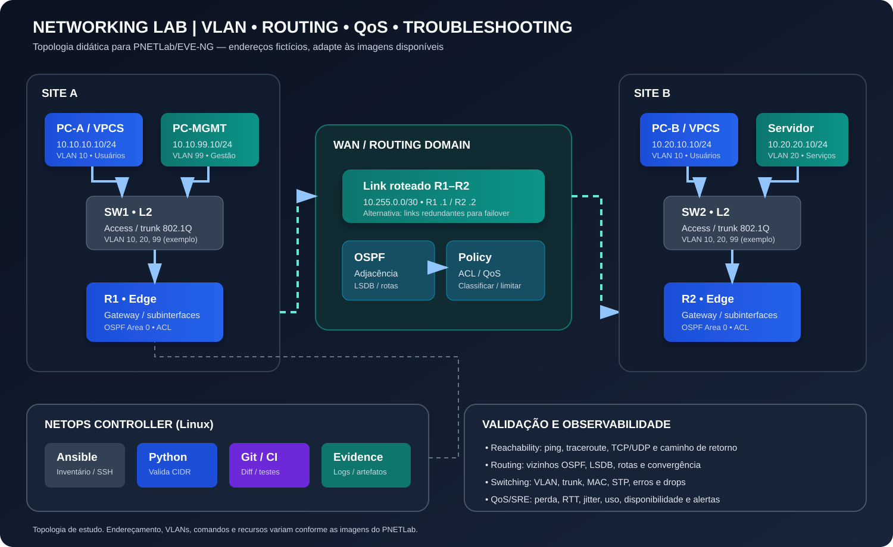

# Networking — switching, roteamento, QoS e troubleshooting

Este módulo é um roteiro prático para estudar redes em PNETLab/EVE-NG. O foco é construir uma abordagem de engenharia: compreender o caminho do pacote, validar o plano de endereçamento, observar o plano de controle e coletar evidências antes de alterar configurações.

> **Aviso:** topologia e endereços fictícios, criados para estudo e portfólio. Não representam a rede interna da ALTAVE. Faça os exercícios apenas em equipamentos próprios ou autorizados.

## Topologia de referência

A topologia contém dois sites, switches Layer 2, roteadores de borda, segmentos de usuários/serviços/gerência, um link roteado e um controlador Linux. Comece com um link único; adicione redundância apenas depois de comprovar a operação básica.

## Objetivos de aprendizagem

- Planejar IPv4/IPv6, sub-redes, gateways e sumarização sem sobreposição indevida.
- Explicar plano de dados, plano de controle e plano de gerenciamento.
- Criar e validar VLANs, portas access/trunk e roteamento inter-VLAN.
- Interpretar rotas conectadas, estáticas, OSPF e noções de BGP.
- Diagnosticar falhas de camada 1/2/3, ACL, MTU/MSS, DNS e caminho de retorno.
- Explicar QoS, DSCP, filas, policing e shaping; QoS não cria banda.
- Automatizar validações repetíveis e manter evidências de antes/depois.

## 1. Inventário da topologia

| Elemento | Rede / identificador | Objetivo |
|---|---|---|
| Site A — usuários | VLAN 10 — 10.10.10.0/24 | Clientes de teste |
| Site A — gestão | VLAN 99 — 10.10.99.0/24 | Acesso administrativo controlado |
| Site B — usuários | VLAN 10 — 10.20.10.0/24 | Clientes de teste |
| Site B — serviços | VLAN 20 — 10.20.20.0/24 | Servidor de teste |
| Link R1–R2 | 10.255.0.0/30 | Trânsito roteado |
| Controlador NetOps | IP conforme a rede de gestão | Ansible, Python, Git |

Gateways sugeridos: .1 em cada LAN. Ajuste VLAN de gestão e IPs dos roteadores conforme as interfaces disponíveis. Não use o mesmo prefixo para segmentos Layer 3 distintos.

### Regra importante sobre VLANs

Uma VLAN é um domínio de broadcast Layer 2. Para comunicação entre VLANs, é necessário um dispositivo Layer 3 — por exemplo, subinterfaces 802.1Q no roteador ou SVIs em switch Layer 3. A VLAN configurada na porta access deve corresponder à VLAN do endpoint; trunks devem transportar apenas VLANs necessárias e ter VLAN nativa consistente nas duas pontas.

## 2. Conceitos essenciais

### Camadas e caminho do pacote

1. **Layer 1:** cabo/link virtual, estado do enlace, negociação e erros.
2. **Layer 2:** VLAN, trunk, MAC, ARP/ND, STP, loops e MTU de enlace.
3. **Layer 3:** endereços IP, máscara/prefixo, gateway, rotas, ACL e caminho de retorno.
4. **Transporte/aplicação:** TCP handshake, UDP, portas, DNS, TLS e serviço de destino.

Use o modelo como checklist, não como regra rígida: um problema pode atravessar várias camadas, e ping bem-sucedido não comprova que uma aplicação esteja funcional.

### Plano de dados, controle e gerenciamento

- **Plano de dados:** encaminha pacotes conforme tabelas instaladas.
- **Plano de controle:** aprende e calcula caminhos, por exemplo via OSPF/BGP.
- **Plano de gerenciamento:** permite configurar e observar dispositivos via SSH, API, SNMP ou telemetria.

Uma adjacência OSPF estabelecida não garante que a rota desejada esteja instalada. Ter uma rota também não garante que ACLs, NAT ou rota de retorno permitam o fluxo fim a fim.

## 3. IPv4, IPv6 e subnetting

Para cada rede, documente endereço de rede, prefixo, máscara, intervalo utilizável quando aplicável, broadcast IPv4, gateway, finalidade, VLAN, VRF e responsável.

- /24 equivale a 256 endereços IPv4 totais; tradicionalmente 254 hosts utilizáveis em uma LAN convencional.
- /30 oferece dois endereços IPv4 utilizáveis e é comum em enlaces ponto a ponto legados.
- /31 pode ser usado em enlaces IPv4 ponto a ponto quando ambos os equipamentos suportam (RFC 3021).
- Em IPv6, planeje normalmente /64 por LAN; não há broadcast IPv6 e Neighbor Discovery substitui funções do ARP.

Não escolha prefixos apenas pelo número atual de hosts: considere crescimento, sumarização, domínios de falha e conectividade com redes existentes.

Comandos Linux:

~~~bash
ip -br address
ip -6 address
ip route
ip -6 route
ip neigh
ip -6 neigh
ip route get 10.20.10.10
~~~

## 4. Switching e VLAN

### Checklist de implementação

- Criar VLANs necessárias e documentar ID, nome e finalidade.
- Configurar portas de endpoint como access na VLAN correta.
- Configurar trunks apenas entre equipamentos que precisam transportar múltiplas VLANs.
- Restringir a lista de VLANs permitidas no trunk.
- Validar VLAN nativa e evitar VLAN 1 para tráfego de usuário/gestão quando a política recomendar.
- Confirmar STP, root bridge esperado, ausência de loops e estabilidade após reconexão.
- Verificar tabela MAC, erros físicos, drops e contadores de interface.

### Comandos de leitura Cisco IOS

~~~text
show vlan brief
show interfaces status
show interfaces trunk
show mac address-table dynamic
show spanning-tree
show interfaces counters errors
show running-config | section interface
~~~

A sintaxe varia conforme a plataforma. Em IOSvL2 alguns recursos podem não estar disponíveis; anote a versão do appliance no relatório do laboratório.

## 5. Roteamento estático e inter-VLAN

Antes de configurar roteamento, confirme endereço/prefixo de cada interface e redes diretamente conectadas. Para comunicação entre VLANs, valide os dois sentidos do fluxo e a rota de retorno.

~~~text
show ip interface brief
show ip route
show ip route 10.20.10.10
show arp
ping 10.20.10.10
traceroute 10.20.10.10
~~~

Em desenho com subinterfaces 802.1Q, confirme que o trunk chega à interface física correta e que o VLAN ID da subinterface coincide com a VLAN do switch. Em switch Layer 3, confirme SVI ativa, VLAN existente, portas ativas e roteamento IP habilitado quando necessário.

Uma rota estática deve apontar para próximo salto alcançável ou interface de saída válida. Documente também a rota de retorno. Não copie comandos sem adaptar endereços, interface e plataforma; valide com a tabela de rotas e teste o caminho completo.

## 6. OSPF — operação e troubleshooting

OSPF é um protocolo IGP de estado de enlace. A formação de adjacência depende, entre outros fatores, de área, timers, tipo de rede, autenticação, MTU em certos estágios e parâmetros compatíveis. O processo calcula caminhos a partir da LSDB e instala rotas elegíveis na RIB/FIB.

### Checklist quando o vizinho não forma

1. Interface e IP estão corretos e ativos?
2. Os dois lados estão na mesma subnet e área esperada?
3. Há ACL, autenticação ou filtro bloqueando OSPF (IP protocol 89)?
4. Timers, tipo de rede, MTU e parâmetros relevantes são compatíveis?
5. A interface foi configurada como passive indevidamente?
6. O Router ID é único?
7. A rota aparece na RIB e existe caminho de retorno?

### Comandos de leitura Cisco IOS

~~~text
show ip ospf neighbor
show ip ospf interface brief
show ip ospf database
show ip protocols
show ip route ospf
show logging
~~~

Não trate ausência de prefixo como problema de adjacência automaticamente. Primeiro determine se a vizinhança está formada; depois confira anúncio, LSDB, filtros, cálculo e instalação da rota.

## 7. BGP — noções para borda e ambientes híbridos

BGP é um protocolo path-vector usado entre sistemas autônomos e em arquiteturas internas específicas. A sessão pode estar Established enquanto uma rota desejada não é aceita, selecionada ou anunciada.

Investigue:
1. Estado TCP/179 e estado da sessão BGP.
2. ASN local/remoto, endereço do peer e reachability.
3. Prefixos recebidos e anunciados.
4. Políticas de importação/exportação, prefix-lists e route-maps.
5. Atributos como LOCAL_PREF, AS_PATH, MED e NEXT_HOP conforme o cenário.
6. RIB BGP, RIB global/VRF e encaminhamento efetivo.
7. Filtros, limites de prefixos e rota de retorno.

Comandos de referência Cisco IOS:

~~~text
show ip bgp summary
show ip bgp
show ip bgp neighbors
show ip route bgp
show running-config | section router bgp
~~~

Em cloud, VPN ou ambientes multioperadora, não anuncie rota default nem prefixos amplos sem decisão de arquitetura, filtros explícitos e plano de rollback.

## 8. ACL, firewall e segmentação

- Use menor privilégio: permitir apenas origens, destinos, protocolos e portas necessários.
- Defina onde a ACL é aplicada e a direção do tráfego.
- Considere tráfego de retorno e o caráter stateful/stateless do dispositivo.
- Preserve acesso administrativo seguro e acesso fora de banda.
- Documente ordem das regras, regra final, logs e responsável.
- Teste fluxos permitidos e negados; evite regras amplas temporárias sem prazo de remoção.

Confirme primeiro a rota, depois a política aplicada em cada salto. Contadores de deny/log ajudam, mas ausência de contador não prova que o tráfego chegou ao ponto de filtragem.

## 9. QoS, latência, perda e jitter

QoS prioriza e controla tráfego em situações de concorrência. Não cria capacidade adicional no link. O resultado depende de classificação, marcação, filas e política em cada gargalo relevante.

- **DSCP:** marcação no cabeçalho IP usada para classificar tráfego.
- **Classification/marking:** identificar o tráfego e atribuir classe.
- **Queuing/scheduling:** decidir qual classe transmite durante congestionamento.
- **Policing:** descartar ou remarcar tráfego que excede uma taxa.
- **Shaping:** suavizar a taxa de saída usando buffer/atraso.
- **Congestion avoidance:** prevenção de filas excessivas, conforme plataforma.

Métricas recomendadas: RTT, perda, jitter, utilização por interface, drops por fila, retransmissões e experiência da aplicação. Não marque todo o tráfego como prioritário; isso elimina o valor relativo da política.

## 10. MTU, MSS, fragmentação e VPN

Sintomas comuns de MTU/MSS incorreto: ping pequeno funciona, transferência grande trava, TLS falha ou certos fluxos têm comportamento intermitente. Túneis adicionam overhead; a MTU útil depende do encapsulamento.

1. Compare MTU em cada segmento e túnel.
2. Teste pacotes de tamanhos progressivos e DF quando suportado.
3. Observe ICMP “fragmentation needed”/Packet Too Big.
4. Valide MSS clamping apenas quando necessário e documente a razão.
5. Capture tráfego nos pontos adequados para comparar pacotes antes/depois do encapsulamento.

~~~bash
tracepath 10.20.10.10
ping -M do -s 1472 10.20.10.10
sudo tcpdump -ni any host 10.20.10.10
~~~

Ajuste payload à família IP, cabeçalhos e MTU esperada. Algumas plataformas não suportam as mesmas opções de ping.

## 11. Troubleshooting estruturado

1. **Definir impacto:** usuários, sites, serviços, horário inicial e mudanças recentes.
2. **Confirmar escopo:** um host, uma VLAN, um site ou todos os destinos?
3. **Validar Layer 1:** interfaces, erros, drops, velocidade e duplex.
4. **Validar Layer 2:** VLAN, trunk, MAC, STP, ARP/ND.
5. **Validar Layer 3:** IP/máscara, gateway, rota de ida e volta, VRF.
6. **Validar plano de controle:** vizinhos, rotas recebidas/anunciadas e convergência.
7. **Validar política:** ACL/firewall, NAT, DNS, MTU/MSS e portas.
8. **Testar aplicação:** conexão TCP/UDP, TLS e logs do serviço.
9. **Aplicar uma mudança por vez**, com aprovação, backup e rollback.
10. **Revalidar e documentar** evidências, causa raiz e prevenção.

Ferramentas Linux:

~~~bash
ip -br link
ip -br address
ip route get 10.20.10.10
ping -c 5 10.20.10.10
traceroute 10.20.10.10
tracepath 10.20.10.10
ss -tulpn
dig exemplo.local
curl -v --connect-timeout 5 https://example.com
sudo tcpdump -ni any host 10.20.10.10
~~~

Capture somente tráfego autorizado; PCAPs podem conter dados sensíveis e devem ser protegidos.

## 12. Laboratórios práticos no PNETLab

| Lab | Exercício | Evidência de conclusão |
|---|---|---|
| NET-01 | Plano IPv4 e conectividade básica | Tabela de endereçamento e ping |
| NET-02 | Criar VLANs e access/trunk | show vlan brief e show interfaces trunk |
| NET-03 | Roteamento inter-VLAN | Ping entre VLANs permitido e teste negado |
| NET-04 | Rotas estáticas e retorno | Tabela de rotas e traceroute |
| NET-05 | OSPF: adjacência e anúncios | show ip ospf neighbor e rotas OSPF |
| NET-06 | Falha OSPF induzida e recuperação | Linha do tempo, logs e convergência |
| NET-07 | ACL e segmentação | Matriz de fluxos permitidos/negados |
| NET-08 | QoS e congestionamento | Política documentada e métricas antes/depois |
| NET-09 | Diagnóstico de MTU/MSS | Testes de tamanho de pacote e captura |
| NET-10 | Runbook fim a fim | Relatório de causa raiz e prevenção |

Comece com NET-01 e avance apenas quando a camada anterior estiver estável. Em cada exercício, salve configuração inicial, comandos de validação, resultado esperado/observado e rollback.

## 13. Checklist de aceite

- [ ] Prefixos e gateways documentados, sem sobreposição indevida.
- [ ] VLANs, portas access e trunks correspondem ao desenho.
- [ ] Endpoints alcançam o gateway correto.
- [ ] Rotas de ida e volta estão presentes.
- [ ] Vizinhanças e prefixos de roteamento foram verificados.
- [ ] Políticas permitem somente os fluxos esperados.
- [ ] Latência, perda e MTU foram considerados.
- [ ] Evidências foram coletadas e segredos removidos.
- [ ] Mudanças foram testadas com plano de rollback.

## Referências oficiais

- [RFC 1918 — Address Allocation for Private Internets](https://www.rfc-editor.org/rfc/rfc1918)
- [RFC 2328 — OSPF Version 2](https://www.rfc-editor.org/rfc/rfc2328)
- [RFC 4271 — BGP-4](https://www.rfc-editor.org/rfc/rfc4271)
- [RFC 8200 — IPv6 Specification](https://www.rfc-editor.org/rfc/rfc8200)
- [RFC 3021 — Using 31-Bit Prefixes on IPv4 Point-to-Point Links](https://www.rfc-editor.org/rfc/rfc3021)

## Relação com os outros módulos

- [Arquitetura e topologia](../01-architecture/README.md)
- [Plano de endereçamento](../01-architecture/addressing-plan.md)
- [LAB-01 — Ansible + Python + PNETLab](../11-labs/LAB-01-ansible-python-pnetlab/README.md)
- [VPN e resiliência](../06-vpn-resilience/runbook.md)
- [Automação Ansible](../03-ansible/ansible.cfg)

*Material de estudo independente. Comandos e funcionalidades dependem do fabricante, versão do sistema operacional e imagens utilizadas no laboratório.*
