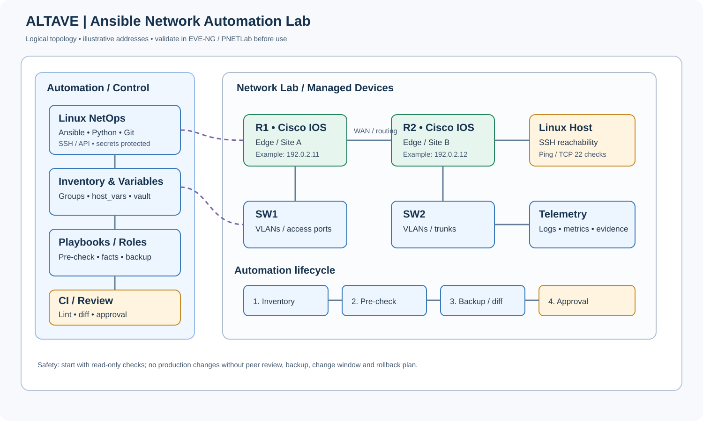

# 03 — Ansible para Network Automation

Módulo prático de automação de redes para o portfólio ALTAVE Network Engineering / NetOps. O foco é demonstrar um fluxo seguro, revisável e repetível para inventariar dispositivos, validar conectividade, coletar fatos e preparar backups antes de qualquer mudança.

> **Importante:** os endereços e dispositivos deste laboratório são exemplos. Os playbooks de validação são de leitura e não substituem testes em EVE-NG/PNETLab nem autorização para operar redes reais.

## Objetivos de aprendizagem

- Organizar inventário YAML por grupos e variáveis reutilizáveis.
- Diferenciar control node, managed node, inventory, playbook, role e collection.
- Validar sintaxe e inventário antes de executar automações.
- Fazer pre-checks e coletar informações de dispositivos sem alterar configuração.
- Preparar backup de configuração e evidências de execução.
- Usar Ansible Vault para segredos, Git para revisão e CI para validação estática.
- Entender a extensão do fluxo para Cisco IOS, RouterOS e Linux, sem misturar módulos de fabricantes diferentes.

## Arquivos do módulo

| Caminho | Propósito |
|---|---|
| ansible.cfg | Configuração local do Ansible |
| inventory/lab.yml | Inventário de laboratório com localhost |
| inventory/network-devices.example.yml | Exemplo de inventário Cisco IOS |
| group_vars/network_devices.yml | Variáveis compartilhadas de conexão |
| playbooks/validate-lab.yml | Validação local sem alteração de rede |
| playbooks/precheck-network.yml | Pre-check de equipamentos Cisco IOS |
| playbooks/backup-config.yml | Backup de configuração de IOS |
| requirements.yml | Collections necessárias |
| topology-ansible.svg | Diagrama visual da arquitetura |

## 1. Pré-requisitos

- Linux, WSL2 ou máquina virtual Linux como control node.
- Python 3 e pip/venv.
- Ansible Core.
- Acesso SSH administrativo aos dispositivos de laboratório, quando usar o inventário de rede.
- Cisco IOS/IOS XE compatível com a collection cisco.ios para os exemplos Cisco.
- EVE-NG, PNETLab ou equipamento autorizado. O modo local funciona sem roteadores.

Crie um ambiente isolado:

~~~bash
python3 -m venv .venv
source .venv/bin/activate
python -m pip install --upgrade pip
python -m pip install ansible ansible-lint
ansible --version
ansible-galaxy collection install -r 03-ansible/requirements.yml
~~~

Execute os comandos a partir da raiz do repositório. Se estiver no diretório 03-ansible, remova o prefixo 03-ansible/ dos caminhos.

## 2. Primeiro teste: ambiente local

~~~bash
cd 03-ansible
ansible-inventory -i inventory/lab.yml --graph
ansible-playbook -i inventory/lab.yml playbooks/validate-lab.yml --syntax-check
ansible-playbook -i inventory/lab.yml playbooks/validate-lab.yml
~~~

Resultado esperado: o Ansible lista localhost, coleta fatos do sistema e termina com a mensagem Lab validation passed. Esse teste não configura roteadores.

## 3. Inventário de equipamentos de rede

Copie inventory/network-devices.example.yml para um arquivo de inventário local não versionado, ajuste os IPs e nomes para seu lab e confirme que existe conectividade de gerenciamento. O exemplo usa endereços de documentação; não os utilize literalmente em produção.

~~~bash
ansible-inventory -i inventory/network-devices.example.yml --graph
ansible-inventory -i inventory/network-devices.example.yml --list
~~~

Não armazene senhas, chaves privadas, tokens ou dados sensíveis no inventário nem em commits Git. Use Ansible Vault ou um gerenciador de segredos. Restrinja a origem do SSH à rede de gerenciamento.

## 4. Variáveis e autenticação

As variáveis de grupo definem o tipo de conexão de rede e o sistema operacional esperado. Ajuste-as de acordo com o dispositivo e a versão da collection. Para IOS/IOS XE, os módulos usam conexão de rede network_cli; isso não é a mesma coisa que uma sessão SSH genérica para Linux.

Exemplo de prompt interativo para laboratório (não é adequado a CI automatizado):

~~~bash
ansible-playbook -i inventory/network-devices.example.yml playbooks/precheck-network.yml --ask-pass --ask-become-pass
~~~

Em ambientes reais, prefira chaves SSH, contas nominativas e privilégios mínimos. Nunca coloque senha em linha de comando, porque pode ficar registrada no histórico ou visível em processos.

## 5. Fluxo recomendado

1. **Inventário:** confirme hosts e grupos.
2. **Lint e sintaxe:** execute ansible-lint e --syntax-check.
3. **Pre-check:** confirme acesso e colete fatos.
4. **Backup:** salve a configuração atual e identifique onde o artefato foi gravado.
5. **Mudança proposta:** use template/diff e revisão por outro engenheiro.
6. **Aprovação:** associe a mudança a uma janela e ticket.
7. **Execução controlada:** aplique apenas a mudança aprovada, com limite de hosts.
8. **Pós-check:** valide rotas, interfaces, vizinhanças e serviços.
9. **Rollback:** restaure conforme o plano se os critérios de sucesso falharem.
10. **Evidências:** registre horário, alvo, commit, resultado e operador sem incluir segredos.

## 6. Comandos úteis

~~~bash
# Inventário e grupos
ansible-inventory -i inventory/lab.yml --graph

# Sintaxe sem executar
ansible-playbook -i inventory/lab.yml playbooks/validate-lab.yml --syntax-check

# Executar localmente
ansible-playbook -i inventory/lab.yml playbooks/validate-lab.yml

# Lint (ajuste caminhos ao executar da raiz)
ansible-lint 03-ansible/playbooks/

# Listar tasks
ansible-playbook -i inventory/lab.yml playbooks/validate-lab.yml --list-tasks

# Verbosidade para troubleshooting
ansible-playbook -i inventory/lab.yml playbooks/validate-lab.yml -vv
~~~

## 7. Troubleshooting

| Sintoma | Verificações |
|---|---|
| Host unreachable | IP de gerenciamento, rota, ACL, firewall e SSH |
| Authentication failed | usuário, chave, método de autenticação e privilégios |
| Collection/module not found | ansible-galaxy collection list e requirements.yml |
| Host key changed | validar a impressão digital por canal confiável; não desabilitar a checagem como solução permanente |
| YAML parse error | indentação, aspas, dois-pontos e ansible-playbook --syntax-check |
| IOS facts falham | suporte do IOS/IOS XE, versão da collection, método de conexão e permissões |
| Backup não encontrado | verificar caminho no control node, permissões e resultado da task |

## 8. Segurança e boas práticas

- Comece com playbooks somente de leitura.
- Use --limit para limitar o escopo de execução.
- Não use host_key_checking = False em produção.
- Não desative validações TLS/SSH para “resolver” erros.
- Separe inventários de laboratório, homologação e produção.
- Não faça commit de vault password files, chaves, inventários sensíveis ou backups de clientes.
- Faça revisão por pares, plano de rollback e pós-check antes de encerrar uma mudança.
- Use serial e estratégia gradual para reduzir o impacto em mudanças futuras.
- Em CI, valide sintaxe e lint; não execute alterações em dispositivos de produção.

## 9. Labs sugeridos

| Lab | Atividade | Evidência de conclusão |
|---|---|---|
| ANS-01 | Preparar Python, Ansible e collections | versões registradas |
| ANS-02 | Criar inventário YAML | grafo de hosts validado |
| ANS-03 | Validar localhost e coletar facts | playbook concluído |
| ANS-04 | Preparar inventário Cisco IOS | hosts e variáveis revisados |
| ANS-05 | Executar pre-check somente leitura | facts e reachability |
| ANS-06 | Fazer backup de configuração | arquivo de backup identificado |
| ANS-07 | Usar Vault para variáveis sensíveis | segredo não aparece em texto claro |
| ANS-08 | Criar role reutilizável | role executada em lab |
| ANS-09 | Adicionar lint/syntax-check ao CI | pipeline passa com sucesso |
| ANS-10 | Implementar change workflow com rollback | plano e pós-check documentados |

## Critérios de aceite

- [ ] Inventário YAML passa na validação.
- [ ] Playbook local executa sem privilégios desnecessários.
- [ ] Playbook de rede usa a collection e connection plugin corretos.
- [ ] Credenciais não estão no Git.
- [ ] Backup e evidências têm caminho e retenção definidos.
- [ ] Mudanças têm revisão, janela, pós-check e rollback.
- [ ] Resultados foram testados e documentados no lab real.

## Referências oficiais

- [Ansible documentation](https://docs.ansible.com/)
- [Network automation guide](https://docs.ansible.com/ansible/latest/network/)
- [Ansible inventory](https://docs.ansible.com/ansible/latest/inventory_guide/intro_inventory.html)
- [Ansible Vault](https://docs.ansible.com/ansible/latest/vault_guide/index.html)
- [Cisco IOS collection](https://docs.ansible.com/ansible/latest/collections/cisco/ios/)
- [Ansible lint](https://ansible.readthedocs.io/projects/lint/)

## Integração com o restante do repositório

- [Arquitetura](../01-architecture/README.md)
- [Networking](../02-networking/README.md)
- [Python para NetOps](../04-python/README.md)
- [CI/CD](../08-ci-cd/README.md)
- [VPN e resiliência](../06-vpn-resilience/runbook.md)
- [Laboratórios](../11-labs/README.md)

**Status:** estrutura de estudo e exemplos documentados. Execute os labs em ambiente controlado e registre as versões testadas antes de afirmar compatibilidade operacional.