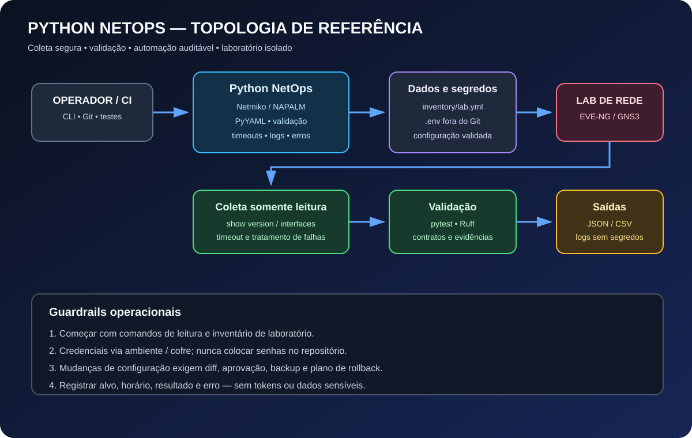

# 04 — Python para Network Automation / NetOps

Módulo prático de Python aplicado à engenharia de redes, com foco em automação segura, repetibilidade, observabilidade e troubleshooting. O material foi organizado para demonstração técnica e evolução em laboratório; execute os exemplos primeiro em EVE-NG, GNS3 ou equipamentos de teste.



## Objetivos de aprendizagem

- Estruturar scripts com funções, módulos, logging, exceções e configuração externa.
- Ler e validar inventários YAML sem codificar endereços ou credenciais no programa.
- Coletar informações de equipamentos via SSH com Netmiko.
- Normalizar resultados e exportar relatórios JSON/CSV.
- Criar testes unitários com pytest e qualidade estática com Ruff.
- Preparar automações para integração contínua e execução controlada.
- Entender quando usar Netmiko, NAPALM, APIs REST, NETCONF/RESTCONF e bibliotecas específicas do fabricante.

## Arquitetura

1. **Operador/CI:** executa comandos explícitos, versiona alterações e valida o código.
2. **Aplicação Python:** carrega inventário, valida entradas, conecta-se ao alvo e trata erros.
3. **Configuração:** inventário YAML versionável; credenciais em variáveis de ambiente ou cofre.
4. **Dispositivos de laboratório:** roteadores/switches com SSH habilitado e usuário de privilégio mínimo.
5. **Saídas:** relatórios e logs úteis para auditoria, sem gravar senhas ou tokens.

## Estrutura do módulo

```text
04-python/
├── README.md
├── topology-python.svg
├── requirements.txt
├── validate_networks.py
├── pyproject.toml
├── .env.example
├── .gitignore
├── inventory/
│   └── lab.yml
├── src/
│   └── netops/
│       ├── __init__.py
│       └── collect_facts.py
└── tests/
    └── test_inventory.py
```

## Requisitos e instalação

Python 3.10+ recomendado. No Windows, prefira WSL2/Ubuntu para ferramentas de rede que dependem de SSH; o script também pode ser executado em Linux ou macOS.

```bash
cd 04-python
python -m venv .venv
# Linux / WSL / macOS
source .venv/bin/activate
# Windows PowerShell: .venv\Scripts\Activate.ps1
python -m pip install --upgrade pip
python -m pip install -r requirements.txt
python -m pip install -e .
```

## Preparar o laboratório

1. Inicie um roteador Cisco IOS/IOS XE no EVE-NG/GNS3 ou outro dispositivo compatível com Netmiko.
2. Habilite SSH e crie um usuário de laboratório com privilégios mínimos necessários para comandos de leitura.
3. Atualize `inventory/lab.yml` com o endereço alcançável **a partir da máquina que executa Python**.
4. Configure as variáveis de ambiente de acordo com `.env.example`. Não faça commit de um arquivo `.env` real.
5. Confirme conectividade e acesso SSH antes de executar o script.

Os endereços `192.0.2.11` e `192.0.2.12` pertencem a uma faixa reservada para documentação. São placeholders, não endereços de dispositivos reais.

## Executar a coleta somente leitura

Linux/WSL/macOS:

```bash
export NETOPS_USERNAME="netops"
export NETOPS_PASSWORD="senha-do-laboratorio"
python -m netops.collect_facts --inventory inventory/lab.yml --output reports/facts.json
```

PowerShell:

```powershell
$env:NETOPS_USERNAME = "netops"
$env:NETOPS_PASSWORD = "senha-do-laboratorio"
python -m netops.collect_facts --inventory inventory/lab.yml --output reports/facts.json
```

O exemplo executa comandos de leitura (`show version` e `show ip interface brief`) e grava os resultados em JSON. A pasta `reports/` é gerada localmente e ignorada pelo Git. Não use credenciais reais em demonstrações ou gravações de tela.

## Validador de prefixos IPv4/IPv6

O script inicial `validate_networks.py` usa apenas a biblioteca padrão do Python para validar CIDRs e apontar sobreposição de prefixos. Exemplo:

```bash
python validate_networks.py 10.10.10.0/24 10.20.10.0/24 10.100.0.0/16
```

O retorno `0` indica que os prefixos são válidos e não se sobrepõem; `1` indica sobreposição; `2` indica entrada inválida. Ele é útil para revisar planos de endereçamento antes de mudanças.

## Testes e qualidade

```bash
pytest -q
ruff check .
ruff format --check .
```

Para executar com inventário inválido, teste primeiro a validação unitária; para testes de integração, use um roteador de laboratório e credenciais dedicadas.

## Conceitos técnicos

### Netmiko
Biblioteca de alto nível para automação via CLI/SSH em diversos fabricantes. Útil quando a interface principal do dispositivo é CLI. O código deve definir timeout, tratar falhas de autenticação/conexão e limitar os comandos permitidos.

### NAPALM
Abstrai operações comuns entre plataformas e oferece getters normalizados, quando o driver do fabricante suporta a funcionalidade. A cobertura varia por sistema operacional e versão.

### APIs e modelos de dados
Quando suportados pelo equipamento, considere APIs REST, NETCONF/RESTCONF e modelos YANG. Prefira interfaces estruturadas à análise de texto CLI sempre que a plataforma oferecer suporte confiável.

### Segurança e mudança controlada
- Comece em modo somente leitura.
- Use contas individuais, privilégio mínimo, SSH e gestão centralizada de segredos.
- Não desabilite verificação de host ou validações TLS como solução permanente.
- Para mudanças, implemente dry-run/diff, aprovação, backup, janela, validação pós-mudança e rollback testado.
- Adicione limites de concorrência e backoff para evitar sobrecarga.
- Nunca execute automaticamente comandos de configuração em produção sem revisão e autorização.

## Roteiro de laboratórios

| Lab | Tema | Entrega / critério de aceite |
|---|---|---|
| PY-01 | Ambiente virtual e dependências | ambiente reproduzível e versões documentadas |
| PY-02 | Inventário YAML | validação de campos obrigatórios e tipos |
| PY-03 | Coleta SSH read-only | versão e interfaces salvas em JSON |
| PY-04 | Tratamento de erros | mensagens úteis para timeout, DNS e autenticação |
| PY-05 | Normalização de dados | relatório consistente entre dispositivos |
| PY-06 | Testes unitários | testes de inventário e caminhos de erro |
| PY-07 | Relatório CSV/JSON | saída rastreável e sem segredos |
| PY-08 | NAPALM getters | comparação de fatos normalizados, se suportado |
| PY-09 | Integração contínua | lint e testes em pull request |
| PY-10 | Plano de mudança | diff, aprovação, validação e rollback documentados |

## Troubleshooting

- **Timeout:** confirme rota, ACL/firewall, IP de gerenciamento e porta TCP/22.
- **Authentication failed:** valide usuário, senha/chave e método de autenticação; não imprima a senha no log.
- **Prompt inesperado:** verifique se o tipo de dispositivo Netmiko corresponde à plataforma/versão.
- **Comando não suportado:** valide o comando manualmente no dispositivo e adapte por plataforma.
- **Arquivo JSON não criado:** confira permissões e caminho de saída.
- **Biblioteca não encontrada:** confirme o ambiente virtual ativo e execute `python -m pip show netmiko`.

## Critérios de conclusão

- [ ] Inventário externo ao código e validado.
- [ ] Nenhum segredo em arquivos versionados, logs ou relatórios.
- [ ] Conexões com timeout e tratamento de exceções.
- [ ] Execução inicial somente leitura.
- [ ] Testes e lint executados localmente.
- [ ] Limitações do laboratório e versões registradas.
- [ ] Evidências e resultados sem dados sensíveis.

## Referências oficiais

- [Python — documentação](https://docs.python.org/3/)
- [Netmiko](https://github.com/ktbyers/netmiko)
- [NAPALM](https://napalm.readthedocs.io/)
- [PyYAML](https://pyyaml.org/wiki/PyYAMLDocumentation)
- [pytest](https://docs.pytest.org/)
- [Ruff](https://docs.astral.sh/ruff/)

> **Nota de escopo:** estes arquivos fornecem uma base didática e devem ser testados no laboratório local antes de qualquer uso operacional. A criação dos arquivos no GitHub não significa que a conectividade com dispositivos tenha sido testada.
